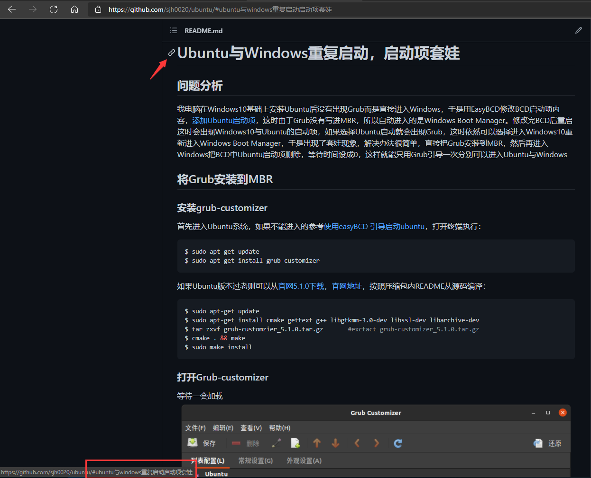

Markdown for Github README.md

## 目录

- [官方简单介绍](#官方简单介绍)
- [标题](#标题)
- [分割线](#分割线)
- [块引用](#块引用)
- [链接](#链接)
- [图片](#图片)

# 官方简单介绍

[中文介绍文档](https://docs.github.com/cn/github/creating-cloning-and-archiving-repositories/creating-a-repository-on-github/about-readmes)

[English](https://docs.github.com/en/github/creating-cloning-and-archiving-repositories/creating-a-repository-on-github/about-readmes)

# 标题

> 一级标题
> `========`
> 二级标题
> `--------`

```bash
# 一级标题
## 二级标题
### 三级标题
#### 四级标题
##### 五级标题
###### 六级标题
```

效果：

> # 这是一级标题
> ## 这是二级标题
> ### 这是三级标题
> #### 这是四级标题
> ##### 这是五级标题
> ###### 这是六级标题

# 分割线

分割线最常使用三个或以上`*`或`-`或`_`

效果：
***
# 块引用

存在多级结构
```Bash
> 区块引用
>> 二级缩进
>>> 三级
>>>> 四级
>>>>> 五级
>>>>>> 六级
```

效果：

> 一
>> 二
>>> 三
>>>> 四
>>>>> 五
>>>>>> 六

# 链接

分为行内式和参考式   
行内式：
| # | 语法 | 效果 |
| --- | --- | --- |
| 1 | `[百度](http://www.baidu.com)` | [百度](http://www.baidu.com) |
| 2 | `[百度](baidu.com "鼠标悬停显示")` | [百度](www.baidu.com "鼠标悬停显示") |
| 3 | `[GitHub仓库中文件链接](https://github.com/sjh0020/aria2/blob/master/README.md)` | [我的aria2README.md](https://github.com/sjh0020/aria2/blob/master/README.md) |
```Bash
[这里是要表示的文字](这里是链接 "这里是鼠标悬浮文本")

如果要跳转到readme.md某个标题位置可以

[文字描述](#要匹配的标题)
```

要注意`，` `,`之类标点会省略，英文字母全小写，空格用`-`表示，如果还不对就参考仓库主页标题旁链接，可以直接复制整个链接或只要#与后面的部分。   

这个跳转可以在README.md页面创建目录导航，因为Github页面自带目录所以`[TOC]` `@[TOC](目录)`之类的不能生效   
效果：

普通：[百度](http://www.baidu.com)

加上悬浮文本：[百度](http://www.baidu.com "这是百度的链接")

[本页面标题：链接](#链接)

# 图片

```Bash
![这里是图片描述，可不填](这里是图片路径，可以是图片相对路径或图床链接 "这里是图片悬浮文本"]

图片超链接
```

效果：

带悬浮文本

